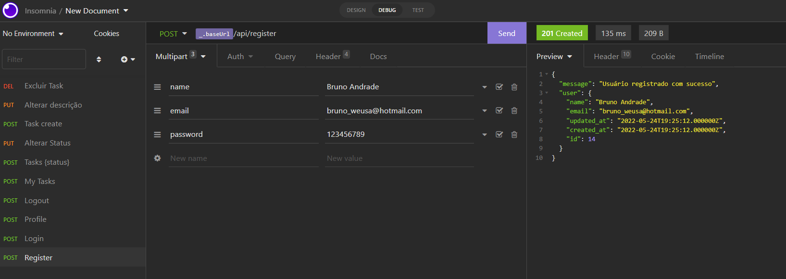
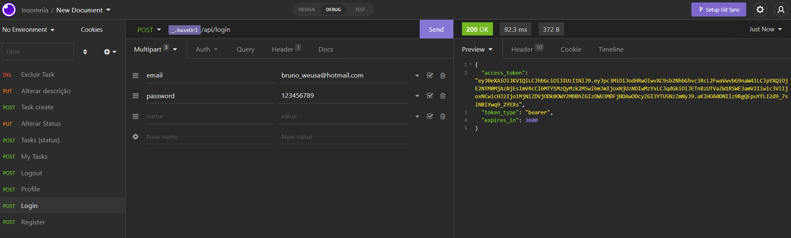
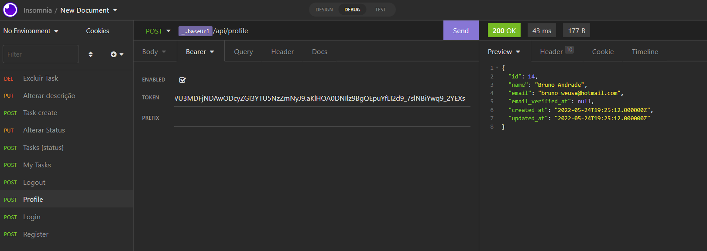
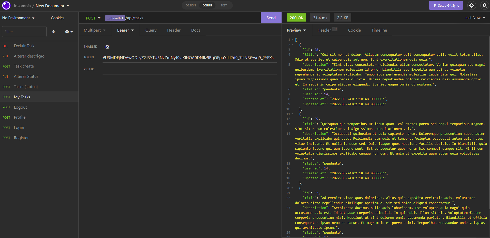
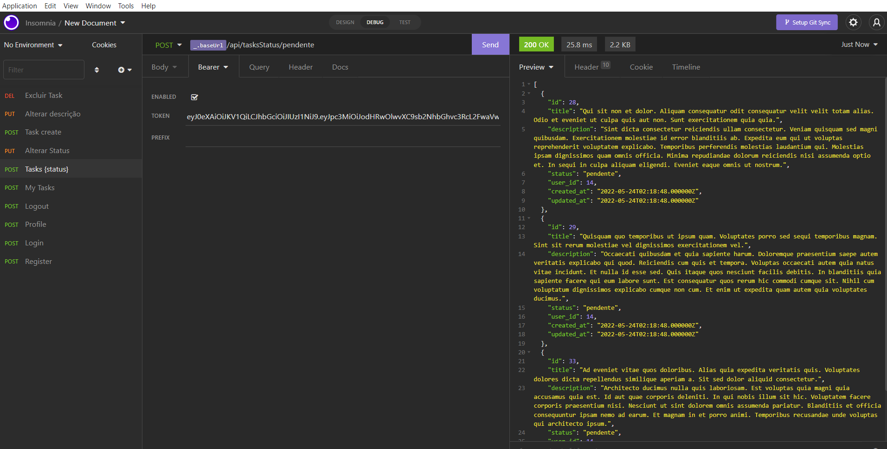
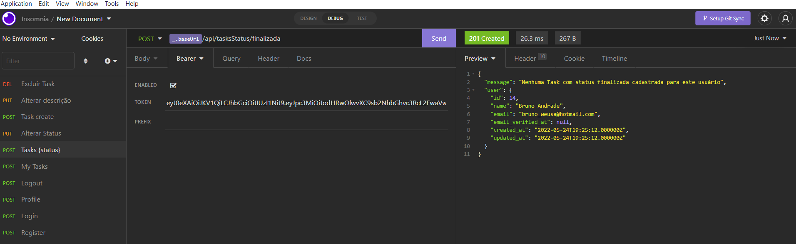
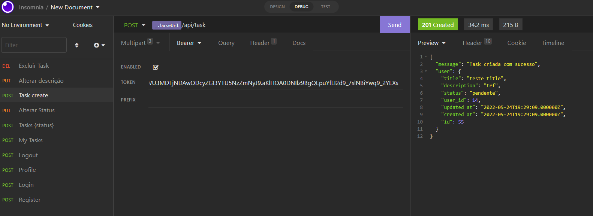
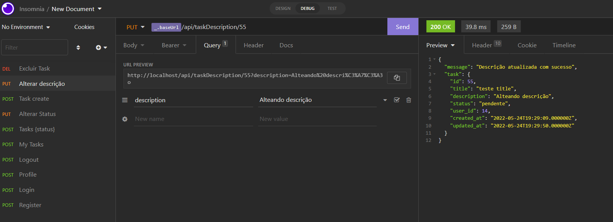
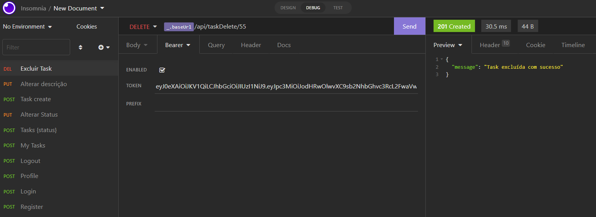

<p align="center"><a href="https://laravel.com" target="_blank"></a></p>


## Sobre o Todo Tasks

Todo Tasks é uma api que gerencia uma lista de tarefas e possui sistema de autenticação por meio de Token JWT.


### **As principais funcionalidades do sistema são as seguintes:**

- Endpoint para o Registro do Usuário;
- Endpoint para o Login do Usuário;
- Endpoint que possibilita o usuário ver todas as suas tarefas (através do login);
- Endpoint que possibilita o usuário identificar quais tarefas ainda não concluiu;
- Endpoint que possibilita o usuário identificar quais tarefas já concluiu;
- Endpoint que possibilita o usuário marcar uma tarefa como concluída;
- Endpoint que possibilita o usuário cadastrar novas tarefas;
- Endpoint que possibilita o usuário alterar a descrição de uma tarefa;
- Endpoint que possibilita o usuário excluir uma tarefa;
- Endpoint que possibilita o usuário ver um relatório com suas tarefas por status;
- Endpoint que possibilita o usuário fazer logoff do sistema;

### Tecnologias utilizadas:

- [PHP +7.4]
- [Framework Laravel 8.x](https://laravel.com/)
- [Laravel sail](https://laravel.com/docs/9.x/sail#installing-sail-into-existing-applications).
- [MySQL]

## Development setup

Basta clonar este repo e dar os comandos abaixo:

```sh
composer install
php artisan jwt:secret
npm install
npm run dev
php artisan migrate
php artisan db:seed
```

```sh
Verificar as configurações no arquivo .env
```

### Prints do Sistema


<em>Endpoint de Cadastro de Usuário</em>

<hr>


<em>Endpoint de Login Usuário</em>

<hr>


<em>Endpoint de Dados do Usuário</em>

<hr>


<em>Endpoint de Listagens das tarefas do Usuário</em>

<hr>


<em>Endpoint de Listagens das tarefas com status pendente</em>

<hr>


<em>Endpoint de Listagens das tarefas com status finalizada</em>

<hr>


<em>Endpoint de Cadastro de tarefa</em>

<hr>


<em>Endpoint de Alteração de descrição de tarefa</em>

<hr>


<em>Endpoint de Exclusão de tarefa</em>

### Autor

- [Bruno Andrade](https://github.com/bnandrade)

## License

The Laravel framework is open-sourced software licensed under the [MIT license](https://opensource.org/licenses/MIT).
